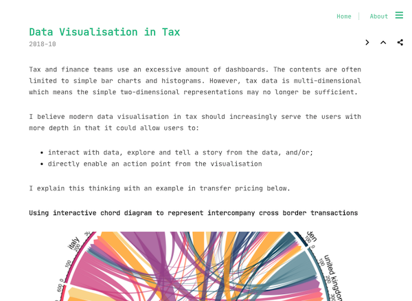

# shan.tax

Website is live at [https://shan.tax/](https://shan.tax/).

## Stack

- ~~[Forestry](https://forestry.io/): Content editing platform. (Forestry was discountinued in April 2023, I am now using Github actions to build the web page.)~~
- [Hugo](https://gohugo.io/): Static site generator.
  - [Hosting Hugo on GitHub](https://gohugo.io/hosting-and-deployment/hosting-on-github/)
- [Cactus](https://themes.gohugo.io/hugo-theme-cactus/): Hugo theme.
  - [Cactus GitHub](https://github.com/monkeyWzr/hugo-theme-cactus)
  - [Example Cactus config](https://github.com/monkeyWzr/hugo-theme-cactus/blob/master/exampleSite/config.toml)
- [GitHub Actions](https://docs.github.com/en/free-pro-team@latest/actions/quickstart): Workflow automation and continuous deployment.
  - [GitHub Actions for Hugo](https://github.com/marketplace/actions/hugo-setup)
    - [https://github.com/peaceiris/actions-hugo](https://github.com/peaceiris/actions-hugo)

---

